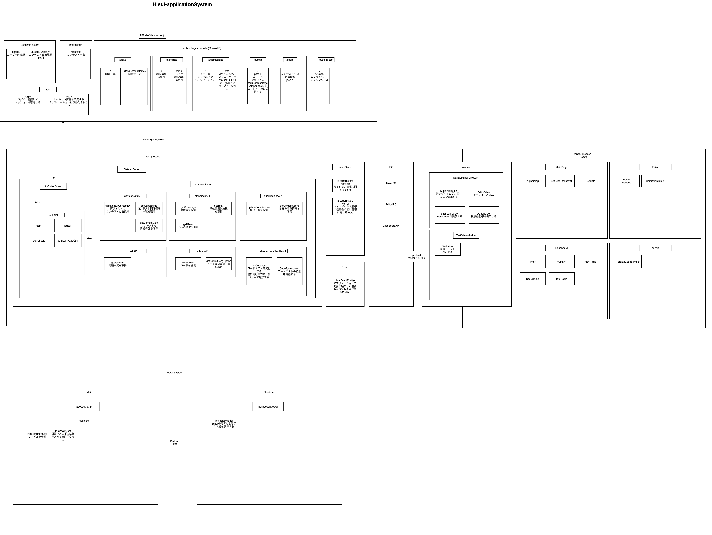

# Contributing to Hisui Projects

Thank you for your interest in contributing!

This application is still in development and has a lot of unfinished parts.
Please make a lot of suggestions.

### Related repository

- [adenohitu/hisui(this repository)](https://github.com/adenohitu/hisui)
アプリケーションのソースコードが管理されています。  
またreleasesによってアプリケーションが配信されています。  
- [adenohitu/Hisui-docs](https://github.com/adenohitu/Hisui-docs)
ここではドキュメントが管理されています。  
[Docusaurus](https://docusaurus.io/)で作成されていて、GitHubPageにデプロイされ公開されています。

### What should I know before I get started?
「Hisui」は、Electronを採用し、Windows・Macで動作するよう設計されています。またUIにReact・Muiを使用し、構成されています。    
>次に示すのは、構想段階のアプリケーションの仕様です。  
>Drow.ioで見ることができます。(archive/draw/hisuisystem.drawio)
>

#### Running Hisui From Source
Nodejs:v16.14.0が必要です。またYarnが使える必要があります。

1. Clone the Hisui repository locally.

```sh
git clone https://github.com/adenohitu/hisui.git
```

2. Change directory to where Hisui has been cloned.

```sh
cd hisui
```

3. Install dependencies.

```sh
yarn
```

4. Start Hisui and explore!

```sh
yarn start
```

作成中、今後追記していきます。
Making. I will add it in the future.