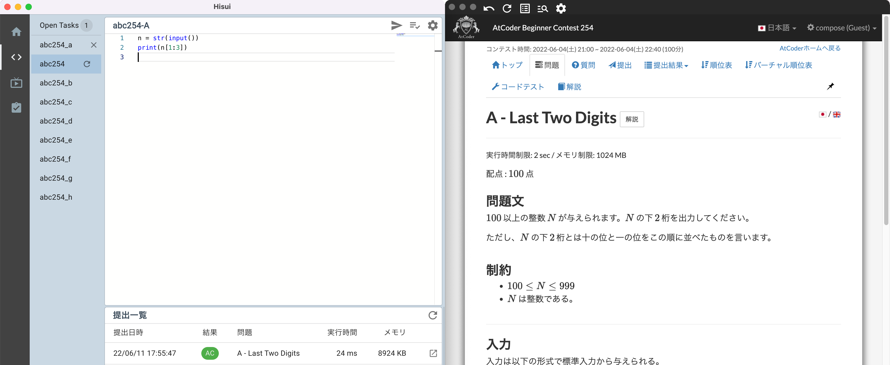
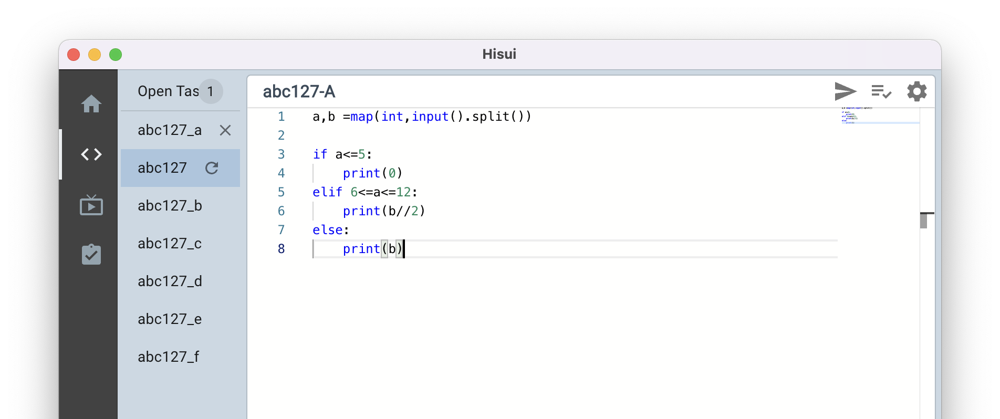
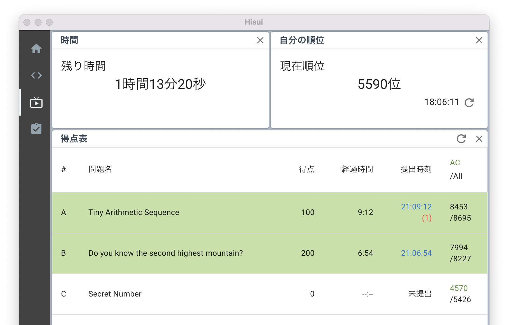
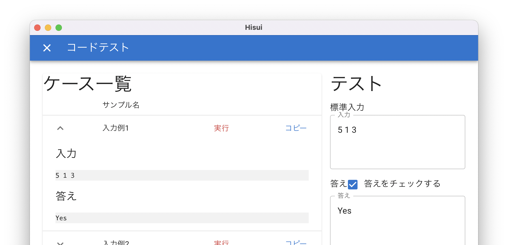

# Hisui--競技プログラミングサポートツール--

This project is archived.

* * *

## :rotating_light: :construction: **警告** :construction: :rotating_light:

このソフトウエアは開発段階です。予期せぬ動作をする可能性があります。
アプリの使用に関して詳しくは、Discordの bataテスト のチャンネルをご覧ください。

* * *

「Hisui」は競技プログラミングサポートツールです。  
競プロの万能ツールのようなものです。
**[紹介サイト](https://adenohitu.github.io/Hisui-introduce/)**

このアプリケーションは、Windows or MacOS で実行することができます。
詳しい使い方は、[hisui-docs](https://adenohitu.github.io/Hisui-docs/docs/intro)（準備中）で知ることができます。

## 競プロのために最適化されたエディター

VSCode のエディターコアとして使われている MonacoEditor を採用

## 必要な情報だけをすぐに見れるダッシュボード

コンテスト中に必要な情報だけを選択して素早く確認することができる

## テストから提出まで

書いたコードをすぐにテスト
問題がなければアプリ内で提出できる

## Hisui の目標

#### 複雑な競技プログラミングの環境をこれひとつで完結させることができる

複雑な環境構築などの作業をなしで、競プロを始められる。  
 コーディングから提出まで一つのアプリケーション内で完結できる。

#### 既に環境がある人に向けて、さらに便利になるようなツールの提供

「問題を解く」ことや「誰かと競争する」という競技プログラミングの醍醐味をもっと楽しめるようにする。

## Contributing to Hisui Projects

質問や意見をするために Discord にチャンネルを用意しています。たくさんの意見をお待ちしています。  
  
また現在 GithubSponsor にて支援を募っています。  
[Github Sponsor @adenohitu](https://github.com/sponsors/adenohitu)  
もしこのアプリケーションに興味を持っていただけたならば、支援もご検討お願いします。  
Issue も歓迎です！まずはDiscord に問いかけてもらえると嬉しいです。  
Bata 版段階では、Pull Request に対応できないかもしれません。不明な点は、Discordコミュニティーにお願いします！
[CONTRIBUTING.md](https://github.com/adenohitu/hisui/blob/main/CONTRIBUTING.md)(作成中)
## License

Copyright (C) 2020-2023 Adenohitu  
このソフトウェアは GNU Affero General Public License v3.0 (AGPLv3)のライセンスのもとで公開されています。  
[LICENSE.md](https://github.com/adenohitu/hisui/blob/main/LICENSE)
